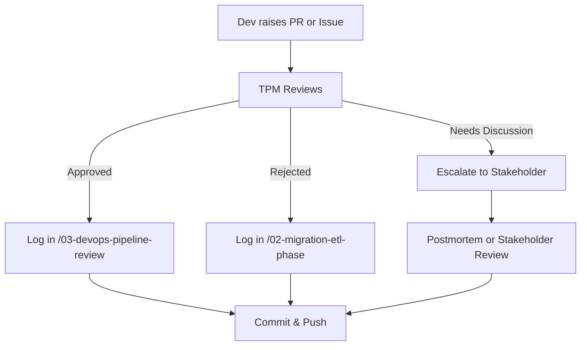

# ✅ CYOA (Cover Your Own Ass) GitHub Log – JDE to Dynamics 365 Migration




This private repository is maintained by **Maurice McDonald**, serving as a personal, time-stamped approval and decision log during the enterprise migration from **JD Edwards 9.2 (JDE)** to **Microsoft Dynamics 365 (D365)**.

It is used in the event you're functioning as a **Technical Program Manager (TPM)** or **Interim Project Manager (PM)**, and you need clear traceability across PRs, issues, decisions, blockers, and executive summaries.

---

## 📋 Real-World Use Cases

- 🔍 Document **Pull Request approvals or rejections**
- 📌 File detailed **Issues** with acceptance criteria
- 🔁 Track **DevOps syncs**, **ETL handoffs**, and **stakeholder decisions**
- ✅ Build a CYA-friendly trail of your decisions with timestamps and commit hashes

---

## 🔧 Commands to Run When Documenting Anything

### ✅ Approve a Pull Request

```bash
echo "# PR 26 Approved" > 03-devops-pipeline-review/PR-26_approved.md
echo "Approved migration of GL tables to Azure SQL – schema validated." >> 03-devops-pipeline-review/PR-26_approved.md

git add 03-devops-pipeline-review/PR-26_approved.md
git commit -m "CYOA: Approved PR#26 GL tables migrated to Azure SQL"
git push
````

---

### ❌ Reject a Pull Request

```bash
echo "# PR 27 Rejected" > 02-migration-etl-phase/PR-27_rejected.md
echo "Rejected due to failed Azure Function pipeline test. Needs rollback plan." >> 02-migration-etl-phase/PR-27_rejected.md

git add 02-migration-etl-phase/PR-27_rejected.md
git commit -m "CYOA: Rejected PR#27 for lack of rollback plan"
git push
```

---

### 🐛 Create an Issue for a Blocker

```bash
echo "# Issue 005 – Power BI not connecting to D365" > 01-discovery-phase/issue-005.md
echo "Integration tests between Power BI and D365 Sales module fail on auth token renewal." >> 01-discovery-phase/issue-005.md

git add 01-discovery-phase/issue-005.md
git commit -m "CYOA: Documented Power BI integration blocker (Issue 005)"
git push
```

---

### 🧠 Add a Decision or Stakeholder Note

```bash
echo "# Steering Committee Decision – July 20, 2025" > 05-postmortem/final-decisions.md
echo "Unanimous decision to sunset JDE by Q1 2026 and accelerate Azure adoption." >> 05-postmortem/final-decisions.md

git add 05-postmortem/final-decisions.md
git commit -m "CYOA: Final JDE sunset decision – July 20, 2025"
git push
```

---

## 📁 Repo Structure Quick Guide

| Folder                       | Purpose                                   |
| ---------------------------- | ----------------------------------------- |
| `00-meta/`                   | Role definitions, glossary                |
| `01-discovery-phase/`        | Issues, assessments, platform comparison  |
| `02-migration-etl-phase/`    | Logs for rejected PRs and data sync notes |
| `03-devops-pipeline-review/` | CI status, validation, and approved PRs   |
| `04-training-adoption/`      | Training plan, stakeholder signoffs       |
| `05-postmortem/`             | Decisions, lessons learned                |
| `logs/`                      | Daily logs, CSV summary of PRs            |

---

## ✅ Git Remote Setup

```bash
git remote add origin https://github.com/emcdo411/cyoa-tpm-approval-jde-to-d365.git
git push -u origin main
```

---

## 🛡️ Tips for Long-Term CYA

* Always include **dates**, **reasoning**, and **responsible parties** in logs
* Save screenshots as needed in `/logs/screenshots/` (if added)
* Push within the day for timestamped visibility
* Use Markdown formatting to make everything readable

---

Built with 💼 by Maurice McDonald — Interim PM | Technical Program Manager | Veteran | Problem Solver

```

---

Let me know if you want to add:
- ✅ Shields.io badges
- 📈 Mermaid workflow diagrams
- 📦 GitHub Actions to enforce log consistency

Ready when you are.
```
